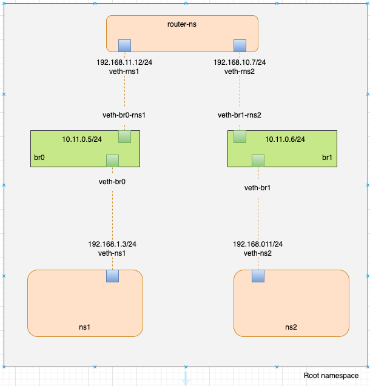
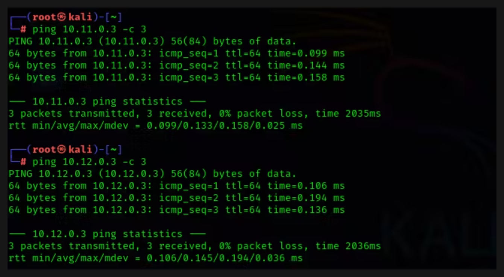
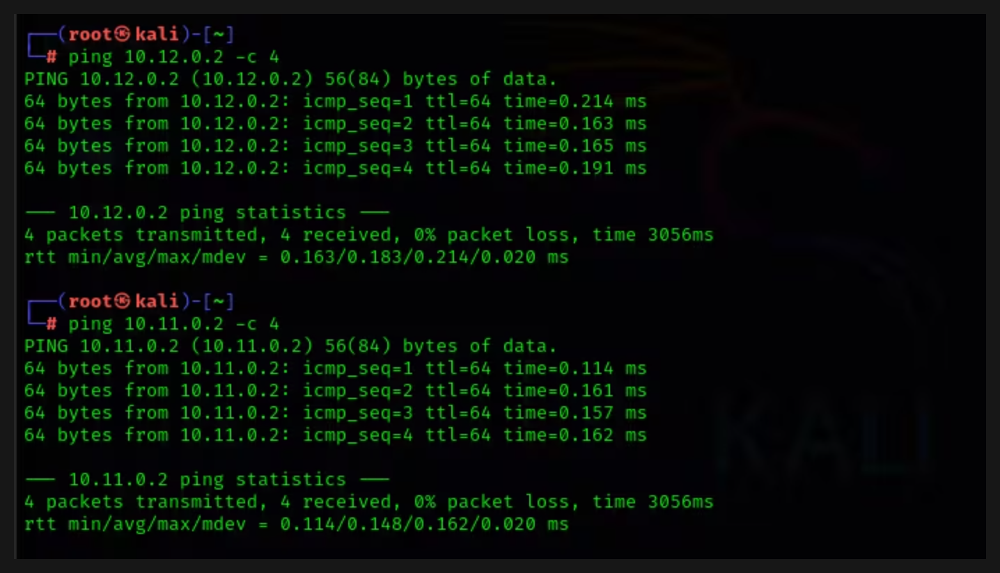
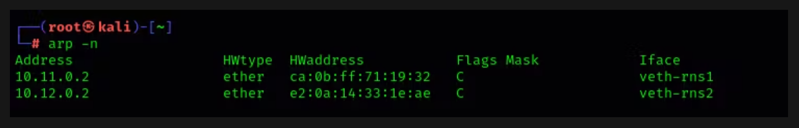

# Linux Network Namespace Simulation Assignment


## Prerequisites

Linux operating system
Root or sudo access
Packages

```bash
sudo apt update
sudo apt upgrade -y
sudo apt install iproute2
sudo apt install net-tools

```

## Network Namespace Diagram

This diagram represents a network namespace setup, It using Linux containers or similar virtualization technologies. Let's break down the components and their relationships.



## Main Task

Create a network simulation with two separate networks connected via a router using Linux network namespaces and bridges.

## Create Network Bridges br0 and br1

Let's create two bridges which represent br0 and br1. Bridges act as virtual switchs, allowing multiple interfaces to be connected to the same network.

First open the terminal as the root user. I can write, 

```bash
sudo su -

```
make sure my possword is correct.

```bash
ip link add br0 type bridge
ip link add br1 type bridge
```

After creating the br0 and br1 let's check if it's create or not

```bash
ip link list

```


## Assign an Ip address to the bridges interface br0 and br1

```bash
ip addr add 10.11.0.1/16 dev br0
ip addr add 10.12.0.1/16 dev br1

```
run 

```bash
ip address add show dev br0
ip address add show dev br1

```


When i created a network interface, it's not automatically active. It exists in the system's configuration, but it's in "down" state. I need to explicitily bring it "up" to make it functional.

```bash
ip link set br0 up
ip link set br1 up

```
Let's check again if it now functional.

```bash
ip link list

```

## Create Network Namespace ns1, ns2 and router-ns

we will create three network namespace ns1, ns2 and router-ns. 

```bash
ip netns add ns1
ip netns add ns2
ip netns add router-ns

```
Let's check again if it created a three namespace.

```bash
ip netns list

```

## Create four virtual Ethernet pairs

```bash
ip link add veth-ns1 type veth peer name veth-br0
ip link add veth-ns2 type veth peer name veth-br1
ip link add veth-rns1 type veth peer name veth-br0-rns1
ip link add veth-rns2 type veth peer name veth-br1-rns2

```
Let's check again if it's created four new veth pairs.

```bash
ip netns list

```

## Connect virtual Ethernet pair with bridge and namespace

## Set the Bridge interface up

we can see interface veth-br0, let's turn on veth-br0 interface which
is connected with br0 bridge.

```bash
ip link set veth-br0 up 

```
## Connect virtual Ethernet pair veth-br0 with br0 bridge

```bash
ip link set veth-br0 master br0

```
It will show all the interface are currentlly UP state.

## Connect virtual Ethernet pair veth-ns1 with ns1 namespace

```bash
ip link set veth-ns1 netns ns1

```
## Assign an Ip address to the ns1 namespace 

```bash
ip netns exec ns1 ip addr add 10.11.0.2/16 dev veth-ns1

```
Let's turn on veth-ns1 interface which is connected with ns1 bridge.

```bash
ip netns exec ns1 ip link set veth-ns1 up

```
## Let's follow the same sequence but make sure pairs name based on your configuration

```bash
# Peer B
ip link set veth-br0-rns1 up 
ip link set veth-br0-rns1 master br0
ip link set veth-rns1 netns router-ns
ip netns exec router-ns ip addr add 10.11.0.3/16 dev veth-rns1
ip netns exec router-ns ip link set veth-rns1 up

```


```bash
# Peer C
ip link set veth-br1-rns2 up 
ip link set veth-br1-rns2 master br1
ip link set veth-rns2 netns router-ns
ip netns exec router-ns ip addr add 10.12.0.3/16 dev veth-rns2
ip netns exec router-ns ip link set veth-rns2 up

```

```bash
# Peer D
ip link set veth-br1 up 
ip link set veth-br1 master br1
ip link set veth-ns2 netns ns2
ip netns exec ns2 ip addr add 10.12.0.2/16 dev veth-ns2
ip netns exec ns2 ip link set veth-ns2 up
```

`sysctl -w net.ipv4.ip_forward=1` : This is the core of the command.  `sysctl` is a command-line utility for examining and modifying kernel parameters.  `-w` tells `sysctl` to write a new value.  `net.ipv4.ip_forward=1` sets the kernel parameter responsible for IP forwarding to 1.  This enables IP forwarding, meaning the system will act as a router and forward packets between network interfaces. `/dev/null` This is a special file that discards anything written to it. It's effectively a black hole for output.


```bash
sysctl -w net.ipv4.ip_forward=1 &> /dev/null
```
This command allows packets entering the system through the br0, br1 interface to be forwarded.

```bash
iptables --append FORWARD --in-interface br0 --jump ACCEPT
iptables --append FORWARD --out-interface br0 --jump ACCEPT
```

```bash
iptables --append FORWARD --in-interface br1 --jump ACCEPT
iptables --append FORWARD --out-interface br1 --jump ACCEPT
```

These commands configure the routing for two different network namespaces, ns1 and ns2.  Each namespace has its own isolated routing table, and these commands set the default gateway for each namespace to a different IP address. This allows each namespace to have its own independent network configuration and potentially connect to different networks or use different routers.

Imagine we have two virtual machines or containers running on a single host.  We want to isolate their network traffic.  We could create two network namespaces, ns1 and ns2, and assign each VM/container to a different namespace.  Then, we could use these commands to configure different default gateways for each namespace, allowing them to connect to different networks or use different routers.


```bash
ip netns exec ns1 ip route add default via 10.11.0.3
ip netns exec ns2 ip route add default via 10.12.0.3
```

```bash
ip netns exec router-ns sysctl -w net.ipv4.ip_forward=1 &> /dev/null
```

## Test connectivity


Let's ping from ns1 to veth-rns1 `ping 10.11.0.3 -c 3` and again ping from ns1 to veth-rns2 `ping 10.12.0.3 -c 3`




Ping from router-ns to ns2 `ping 10.12.0.2 -c 3` and again ping from router-ns to ns1 `ping 10.11.0.2 -c 3`



`arp -n` The ARP table shows how the system has learned the MAC addresses associated with different IP addresses on the local network.  When the computer wants to communicate with another device on the same local network, it needs to know the destination device's MAC address.  It uses ARP to discover this.

